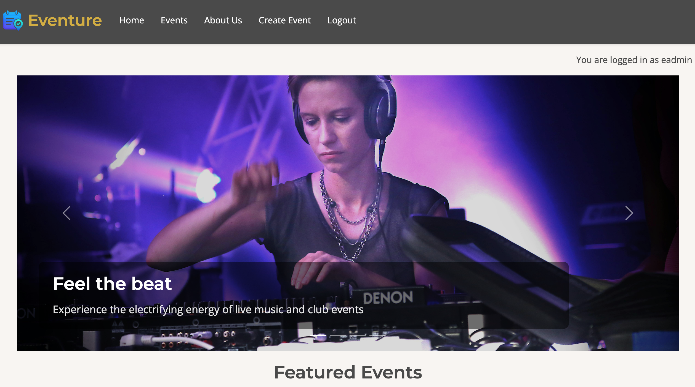
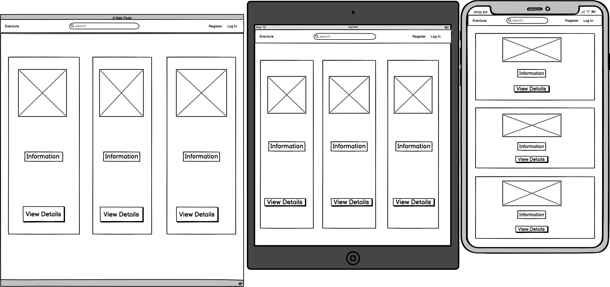
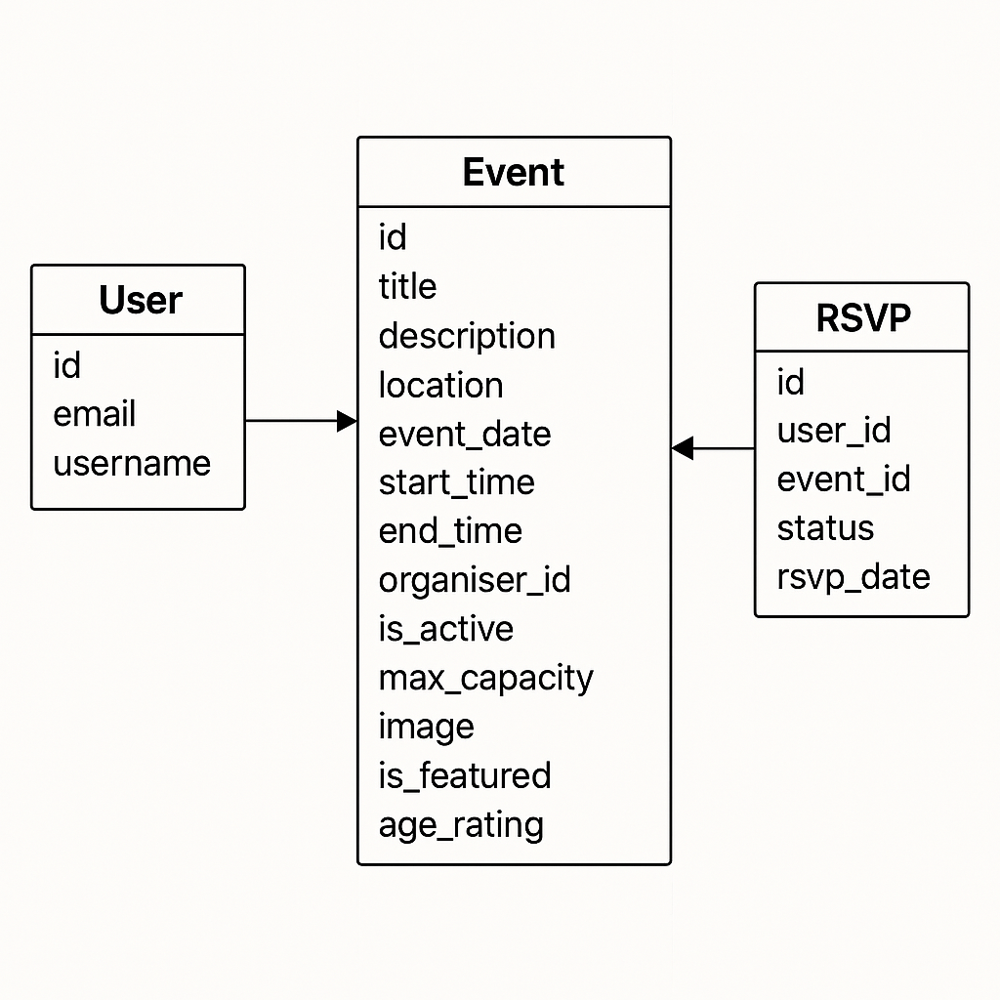

# Eventure

# Overview
Eventure is our hackathon project to make a functioning full-stack website with CRUD functionality using python, HTML, CSS & Javascript. We decided to create an app where approved users can post events and general users can browse upcoming events and rsvp to them. 

The live project can found here: <a href="" target="_blank">Live Project</a>

<h2 text-align="center" id="TOC">Table of Contents</h2>

- [Eventure](#eventure)
  - [Overview](#overview)
  - [Table of Contents](#TOC)
  - [UX Design](#ux-design)
    - [User Stories](#user-stories)
    - [Wireframes](#wireframes)
    - [Logo Design](#logo-design)
- [Key Features](#key-features)
- [Deployment](#deployment)
- [AI Implementation and Orchestration](#ai-implementation-and-orchestration)
- [Future Enhancements](#future-enhancements)
- [Credits](#credits)

<a href="#eventure">Back To Top</a>

 

## UX Design
# User stories
We used an agile workflow for the project, creating user stories and adding them to the Github project kanban board, including small actionable steps to achieve an MVP and also additional potential features, such as attaching the Google maps API to the location of the events. 

You are view the user stories here in the [GitHub Projects Kanban Board](https://github.com/users/LorealCI/projects/9)

# Wireframes
These wireframes show the event lists pages for computer, tablet and mobile. The site is responsive to different screen sizes so users can access it easily accross different devices. 

# ERD
We created the ERD with chatGPT. Throughout the project we updated the event model field to include more features that we wanted to include.

- **Design Rationale:**
  - We used a white background and a fairly minimalist colour scheme that doesn't overwhelm the user, allowing them to focus on the posted events.
  # Logo Design
  I asked chatGPT to generate a logo/favicon. Since the purpose of the website is to post and view events, the logo was designed to look like a calendar with a pinpoint for location. The blue/green/purple colours stand out against the white background of the website and make it instantly recognisable for users. 
  
  

<a href="#eventure">Back To Top</a>

 

## Key Features

# Home page (with carousel & featured events)
The home page features a carousel of the kinds of events the users can find & uses dynamic visuals to pique their interest and curiosity to browse.

# Events page (& events detail page) 
This page displays all of the key details for the events. The users can click on the event to see more details of any particular event.

The events cards have the option for users to display a picture to advertise the events and make the site more engaging. Because we were making examples, we found pictures on [pexels](https://www.pexels.com/). For example, here are some of the images we used:

And here are the links to the other images:

80' disco: https://www.pexels.com/photo/vibrant-disco-balls-ceiling-art-installation-31266655/

r&b brunch: https://www.pexels.com/photo/a-man-in-a-hoodie-rapping-7972040/

card show: https://www.pexels.com/photo/yu-gi-oh-trading-card-game-collection-on-table-31296168/

well-being: https://www.pexels.com/photo/close-up-shot-of-a-person-sitting-on-a-yoga-mat-while-meditating-8534279/

cocktails: https://www.pexels.com/photo/cocktail-and-orange-slices-16148201/

conference: https://www.pexels.com/photo/people-sitting-watching-in-the-theater-301987/

expo: https://www.pexels.com/photo/people-sitting-at-event-22669860/

# About Us page
This page tells the users about the purpose of the website & why we made it.

# Create Event page 
This page is for approved users to create events that they want to post and advertise.

# Logging in/out 
We have user accounts so only approved authors can create & edit events but users can view and rsvp to the events they are going to attend. 

# Footer
The footer includes links to social media. 

- **Inclusivity Notes:** 
  - Features include ARIA labels for screen readers.

<a href="#eventure">Back To Top</a>

 

## Deployment
- **Platform:** Heroku
- **High-Level Deployment Steps:** 
  1. Clone the repository
  2. Set up the Heroku environment with a PostgreSQL database.
  3. Configure environment variables for sensitive data (e.g., secret keys).
  4. You can eploy using Heroku Git or GitHub integration, but in my case I am using GitHub integration.
- **Verification and Validation:**
  - Tested the deployed application against the development environment for consistent functionality and design.
  - Verified accessibility using tools such as Lighthouse and manual testing.
- **Security Measures:**
  - Sensitive data is stored in environment variables.
  - DEBUG mode is disabled in the production environment to enhance security.

<a href="#eventure">Back To Top</a>

 

  ## AI Implementation and Orchestration

### Use Cases and Reflections:
We utilised Microsoft Co-pilot which is built into VS code, ChatGPT & Claude for various parts of the project, including code creation, getting & refining ideas, generating user stories, logos/erd etc. It's an invaluable resource for speeding up the app-making process, especially with the hackathon being limited to 3 days.

<a href="#eventure">Back To Top</a>

 

# Testing
To be completed at a later date!

## Future Enhancements
- Add an API to auto-fill the location
- Add a page where users can see their past and upcoming events
- Build multilingual support for non-English-speaking users.
- Add Google Maps API for users to more easily find where the event is.
- Include the option for ticketing/purchasing.

## Credits
We would like to credit Code Institute's CodeStar walkthrough blog and our supervisor Dillon(https://github.com/dillon-mccaffrey-ci) for supporting us. 

<a href="#eventure">Back To Top</a>

 